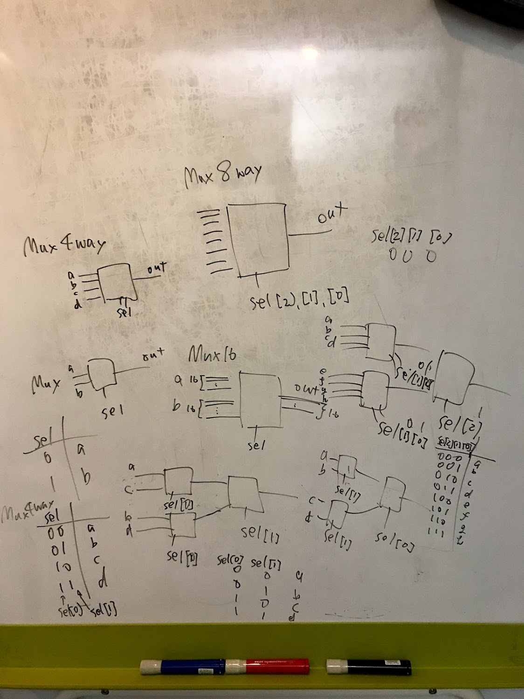

2019-04-01 23:22:58

# ブール論理
ブール代数で形式化され2値の意味論を与えられた命題論理

論理回路(組み合わせ回路) を記述するために、ブール論理を用いる。

## 感想
懐かしい。学部のときに習ったやつ。
真理値表を先に覚えると、意味論と構文論がごっちゃになってしまうのでちょっと注意が必要だと思う。

# ブール代数
ブール代数はブール値(2値、yes, no だとかのラベルを扱う)を扱う。

* ブール関数は、ブール値を受け取ってブール値を返す関数

ブール関数を真理値表で表したりする。

状態数は n 個のブール変数に対して `2^n` 通り

ブール式の基本は And, Or, Not の3つの演算子である。

* And は 掛け算
* Or は足し算
* Not は反転
っぽいイメージ

どんなブール関数でも正準表現 (canonical representation) で表せる。

## 正準表現
真理値表の 1 となる行に注目して、リテラルを And で結合してそれらを Or で足し合わせた式

n 個のバイナリ変数によって定義されるブール関数は `2^2^n` 通り存在する。

例

| x | f(x) |
|:--|:-----|
| 0 | 0    |
| 1 | 0    |

| x | f(x) |
|:--|:-----|
| 0 | 0    |
| 1 | 1    |

| x | f(x) |
|:--|:-----|
| 0 | 1    |
| 1 | 0    |

| x | f(x) |
|:--|:-----|
| 0 | 1    |
| 1 | 1    |

の 4通り
つまり 1つのバイナリ変数によって定義されるブール関数は次のものがある  `nil`, `x`, `not x`, `not x And x`

他の例

| x | y | f(x, y) |
|:--|:--|:--------|
| 0 | 0 | 0       |
| 0 | 1 | 0       |
| 1 | 0 | 0       |
| 1 | 1 | 0       |

| x | y | f(x, y) |
|:--|:--|:--------|
| 0 | 0 | 0       |
| 0 | 1 | 1       |
| 1 | 0 | 0       |
| 1 | 1 | 0       |

| x | y | f(x, y) |
|:--|:--|:--------|
| 0 | 0 | 0       |
| 0 | 1 | 0       |
| 1 | 0 | 1       |
| 1 | 1 | 0       |

...

| x | y | f(x, y) |
|:--|:--|:--------|
| 0 | 0 | 1       |
| 0 | 1 | 1       |
| 1 | 0 | 1       |
| 1 | 1 | 1       |

が、 16 個できる。
つまり、 n 個のバイナリ変数で定義されるブール関数は `2^2^n` 通り存在する

## Nand (Nor)
Nand 関数さえあれば、 And, Or, Not すべてを表現できる。
つまり、すべての論理回路は Nand だけで表現できる。
(Nor も同様)

Nand: `Not (x And Y)`
Nor: `Not (x Or y)`

## 基本論理ゲート
ゲート = 回路

トランジスタ スイッチ素子

ゲートは、 トランジスタを組み合わせて実現される。

基本ゲートを組み合わせて複合ゲートを実現する。
基本ゲートは 2入力 1出力の And, Or だったり、 1入力 1出力の Not のこと。

論理設計とは、簡単に言えば、ゲートのつなぎ方に関する技法のこと

インターフェースと実装

例
* インターフェース： 3入力 1出力 の Andゲート
* 実装： 2入力 1出力のAndゲートを2つ組み合わせる


## HDL
実際に回路を物理的に自作してインターフェースを満たす論理ゲートを作成せずともソフトウェアでゲート(回路)をシミュレートできる。

> コンピュータ上でハードウェア記述言語(Hardware Description Language、 HDL)を用いて、回路のアーキテクチャを設計し、最適化について考えることがで きる(HDL は VHDL としても知られている。V は Virtual を意味する)。設計者は 回路の構造を HDL プログラムで表現し、その後で厳密なテストを行う。テストはコ ンピュータのシミュレータ上で仮想的に行うものであり、具体的にはハードウェアシ ミュレータ(hardware simulator)と呼ばれる特別なソフトウェアツールを用いる。 ハードウェアシミュレータは HDL で書かれたプログラムを入力として読み込み、メ モリ上にそのプログラムで指定された回路を構成する。

Nand ゲートのみがプリミティブである。
Nand のみを使って、いろいろな回路を実装する。

マルチプレクサ：
どれを出力するかを決める
n入力 1出力
```
Mux
input: a, b, sel
output: out
function: if sel=0 then out=a else out=b
```

* 「データビット」と呼ばれるふたつの入力からひとつを選択して出力するために、「選択ビット」(セレクタ)と呼ばれる入力がひとつ用いられる。




デマルチプレクサ：
どこに出力するかを決める
1入力 n出力
```
DMux
input: in, sel
output: a, b
function: if sel=0 then {a=in, b=0} else {a=0, b=in}
```


## 多ビットの基本ゲート
> コンピュータのハードウェアは「バス」と呼ばれる複数のビットからなる配列を操作するように設計されているのが一般的である。たとえば、32 ビットのコンピュータ は 32 ビットのバス 2 本に対して And 関数を行う必要がある。この操作を実装するた めには、バイナリの And ゲートを 32 個用意し、各ゲートがペアとなるビットを別々 に処理すればよい。

バスっていうのは、 各入力や出力の単位のこと。 syntax 的には、バスとは、複数のビットからなる配列のこと
この場合は a とか b とか out にあたる

32 ビットのコンピュータの場合は、 a とか b とか out はそれぞれ 32 ビットを持つ

```
a --|--
    |  )-- out
b --|--
```

多ビット Or
```
Or32
input: a[32], b[32]
output: out[32]
function: For i=0..31 out[i] = Or(a[i], b[i])
```

## 多入力の基本ゲート

多入力 Or
n入力のうち少なくとも1つが1であれば、1を出力する。それ以外は0を出力する。
```
Or8Way
input: in[8]
output: out
function: out=Or(in[0],in[1],...,in[7])
```

## 実装
* MIL 記号を使った論理回路と HDL との対応を考えると実装しやすい
カッコの内側にあればあるほど、論理回路図では、最初に通るゲートとなる。

Mux の実装がむずい。。
カルノー図：複雑な論理式を簡単に表記することを目的とした図 を使って解いた。
カルノー図の作り方忘れてたし、なんでこれで正しい論理式ができるんだ？ってなった。

DMux は2個出力があるのでそれぞれ独立に考えてあげれば良い。
Mux も DMux も sel を 反転させるところがコツかな。

Mux4Way16 でも詰まった。。

注意しないといけないのは sel の順番。
sel[1], sel[0] なので注意。

ビットの桁と対応しているからそうなんだろうけど、単純に見た目が逆転してるから分かりにくい。
コツは、 sel の使い方

16bit の 4入力 1出力
2bit の sel で どの入力を出力するかを決める

# まとめ
プリミティブの Nand 回路だけを用いて And, Or などの論理回路を実装した。

## 成果物
* And
* Or
* Xor
* Not
* Not16, And16, Or16, Mux16 … 16 進数の 論理ゲート
* Mux マルチプレクサ ハードウェアレベルで if 文を表現できる
* DMux デマルチプレクサ
* Mux8Way16, DMux8Way, DMux4Way .. 16 進数のマルチプレクサ
